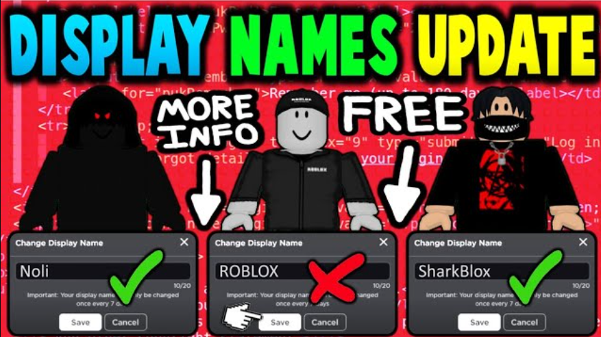

# 🕹️ Roblox Del Bienestar APK: Diversión y Creatividad para Todos
## [Descargar Roblox Del Bienestar](https://apkmodjoy.net/es/roblox-del-bienestar/)

## 🎮 ¿Qué es Roblox Del Bienestar?

Roblox Del Bienestar APK es una versión especial de la famosa plataforma de juegos **Roblox**, diseñada para promover el bienestar digital y emocional de sus usuarios. Esta edición busca ofrecer una experiencia segura, creativa y educativa para jóvenes y adultos jóvenes, permitiendo explorar mundos virtuales mientras se aprende sobre hábitos saludables, colaboración y empatía.

Con miles de juegos generados por la comunidad, **Roblox Del Bienestar** se centra en actividades que fomentan el pensamiento positivo y el desarrollo personal. Es ideal para quienes buscan entretenimiento sin contenido inapropiado o violento.

## 🎮 Gráficos en el juego

Los gráficos de **Roblox Del Bienestar** mantienen el estilo característico de Roblox: personajes estilo bloque, colores vibrantes y mundos únicos. Aunque no apunta al realismo extremo, su diseño visual amigable y accesible lo hace perfecto para usuarios de todas las edades. Las animaciones suaves y los entornos bien construidos garantizan una experiencia envolvente.

## 🎮 Características destacadas

* 🌟 Juegos centrados en el bienestar emocional
* 🌈 Actividades cooperativas y educativas
* 🔒 Entorno seguro sin contenido ofensivo
* 🧠 Juegos que fomentan la creatividad y la resolución de problemas
* 📱 Interfaz optimizada para dispositivos móviles

## 🎮 Diseño y experiencia del usuario

La interfaz de **Roblox Del Bienestar APK** está pensada para ser intuitiva y fácil de usar. Los menús están claramente organizados y permiten navegar sin complicaciones entre diferentes juegos y opciones. El diseño limpio y los controles responsivos hacen que la experiencia sea cómoda, incluso en pantallas pequeñas.

## 🎮 Conclusión

**Roblox Del Bienestar** es más que un simple juego: es una plataforma para crecer, aprender y divertirse sanamente. Perfecto para quienes buscan una alternativa segura y educativa, sin contenido inapropiado. ¡Descárgalo hoy y comienza tu aventura hacia el bienestar digital!